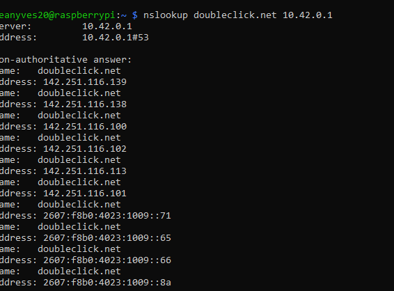
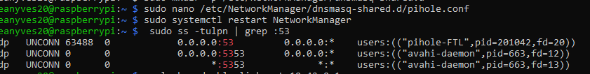
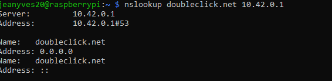
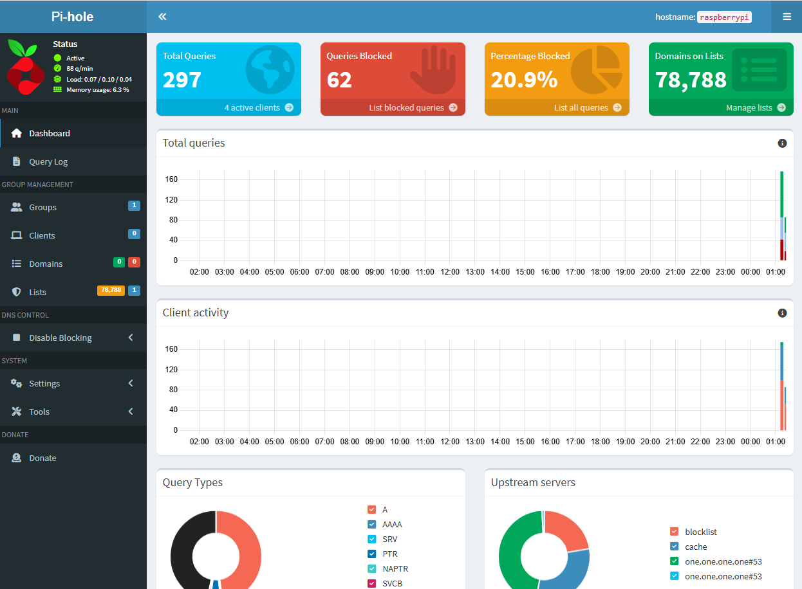
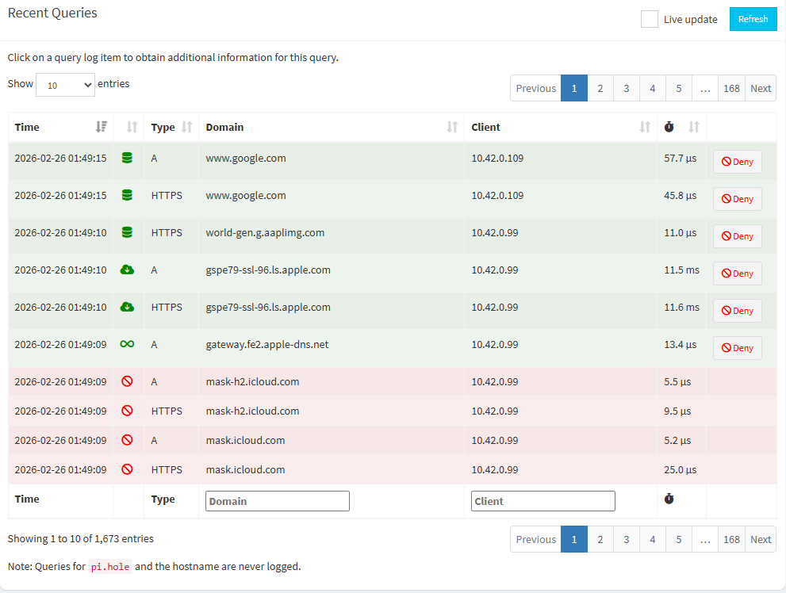

# Pi-hole Raspberry Pi 5 Isolated Lab (NetworkManager Hotspot + Pi-hole DNS)

I built an isolated Wi-Fi network (PiTestNet) on a Raspberry Pi 5 and configured **Pi-hole** as the DNS server so all connected devices benefit from DNS-level ad/tracker blocking.

This repo also documents the main issue I hit: NetworkManager hotspot mode can spawn `dnsmasq`, which may conflict with Pi-hole on **DNS port 53**—and how I fixed it.

---

## Documentation (clickable)

- **[Architecture](docs/architecture.md)**  
- **[Troubleshooting](docs/troubleshooting.md)**  
- **[Glossary](docs/glossary.md)**  

---

## What I built
[Devices]
↓
(wlan0) 10.42.0.0/24 ← PiTestNet Hotspot
↓
Raspberry Pi 5 (10.42.0.1)
├─ Pi-hole DNS filtering
└─ NAT to eth0
↓
(eth0) Internet uplink (ex: 192.168.0.64)
↓
Internet

---

## Screenshots

- SSH connection: 
- Installing Pi-hole: 
- DNS conflict (dnsmasq + Pi-hole): 
- Not blocking case: 
- Fixed (only Pi-hole on port 53): 
- Blocking confirmed (0.0.0.0): 
- Dashboard: 
- Query Log: 

---

## Quick validation

From a device connected to PiTestNet:

```bash
nslookup doubleclick.net 10.42.0.1
```
**Expected:** 0.0.0.0 and/or ::

## The NetworkManager “shared mode” DNS fix (config)

The key fix I used is stored as an example here:

- configs/NetworkManager/dnsmasq-shared.d/pihole.conf.example

To apply it on the Pi:
``` bash
sudo mkdir -p /etc/NetworkManager/dnsmasq-shared.d
sudo cp configs/NetworkManager/dnsmasq-shared.d/pihole.conf.example \
  /etc/NetworkManager/dnsmasq-shared.d/pihole.conf
sudo systemctl restart NetworkManager
```

## Useful scripts
Make executable:
``` bash
chmod +x scripts/*.sh
```
Run:

- ./scripts/check-ports.sh → who owns port 53

- ./scripts/test-blocking.sh → google allowed + doubleclick blocked

- ./scripts/check-nat.sh → NAT (MASQUERADE) sanity check

- ./scripts/quick-status.sh → one-shot health overview
